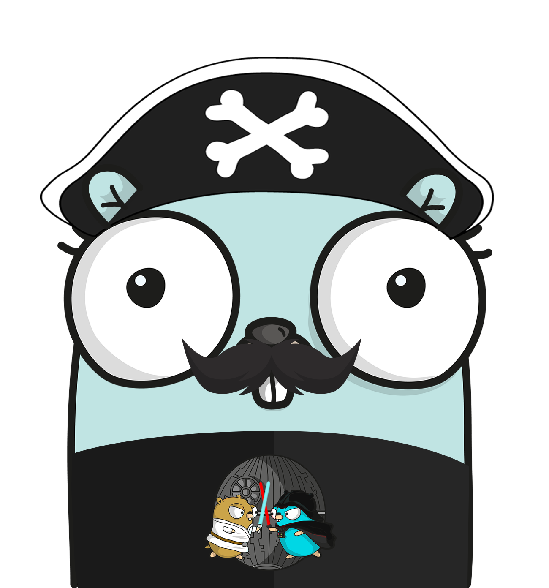

<p align="center" >
    
<h3 align="center">bucketscan</h3>
<p align="center">Simple Golang bucket brute force scanner</p>
<p align="center">Build with ❤ in Golang</p>
</p>

<p align="center" >
    
    
    
</p>

<!-- START doctoc generated TOC please keep comment here to allow auto update -->
<!-- DON'T EDIT THIS SECTION, INSTEAD RE-RUN doctoc TO UPDATE -->
**Table of Contents**  *generated with [DocToc](https://github.com/thlorenz/doctoc)*

- [Badges](#badges)
- [Example](#example)
- [Installation](#installation)
  - [Quick installation (latest version)](#quick-installation-latest-version)
- [Usage](#usage)
- [Credits](#credits)
- [TO DO](#to-do)
- [Contribution](#contribution)
- [LICENSE](#license)
- [TO DO](#to-do-1)

<!-- END doctoc generated TOC please keep comment here to allow auto update -->

# Badges


[](/LICENSE)
[](https://github.com/containerscrew/bucketscan/releases/latest)
[](https://somsubhra.github.io/github-release-stats/?username=containerscrew&repository=bucketscan)


# Example


# Installation

## Quick installation (latest version)

```bash
curl --proto '=https' --tlsv1.2 -sSfL https://raw.githubusercontent.com/containerscrew/bucketscan/main/scripts/install.sh | bash
```

Take a look inside docs [install](./docs/install.md)

# Usage

# Credits
- [Distroless for container build](https://github.com/GoogleContainerTools/distroless)
- [Git leaks](https://github.com/gitleaks/gitleaks-action)

# TO DO

* Improve error handling
* Add tests, although I have no experience
* Code refactor is certainly needed!

# Contribution

Pull requests are welcome! Any code refactoring, improvement, implementation.

# LICENSE

[LICENSE](./LICENSE)

# TO DO

* counter 80urls scanner / 1024 ...
